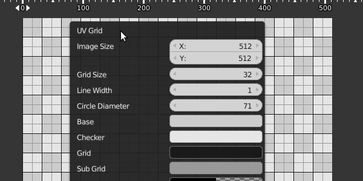
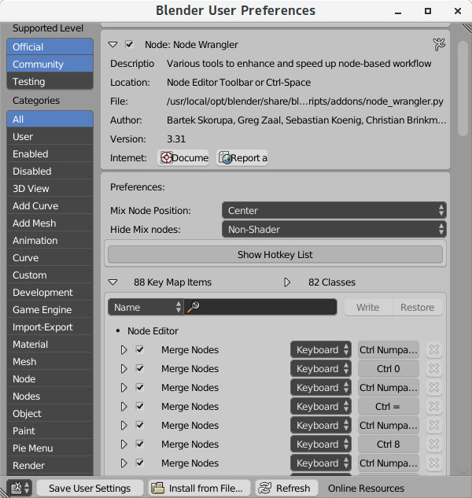

# Blender Addon 'CTools'

下記の物をまとめたアドオン

## [Edit Mesh Draw Nearest](https://github.com/chromoly/blender-EditMeshDrawNearest 'Screencast Key Status Tool')
マウスクリックで次に選択するであろう要素を強調表示する。  


## [Lock Coordinates](https://github.com/chromoly/blender_lock_coords 'Lock Coordinatesl')  
頂点の移動、選択を抑制する。  


## [Lock 3D Cursor](https://github.com/chromoly/lock_cursor3d 'Lock 3D Cursor')  
マウスクリックでの3Dカーソル移動を禁止する。以前コミットされ、その後消されたものをアドオンで再現。  


## [Mouse Gesture](https://github.com/chromoly/blender_mouse_gesture 'Mouse Gesture')  
マウスジェスチャー。  


## [Overwrite Builtin Images](https://github.com/chromoly/blender-OverwriteBuiltinImages 'Overwrite Builtin Images')
スプラッシュとアイコン画像を変更するアドオン(Linux専用)。  
同梱のoverwrite_builtin_images.pyはバイナリに埋め込まれた画像を書き換えるスクリプト(Windows/Linux)。  


## [QuadView Move](https://github.com/chromoly/quadview_move 'QuadView Move')
マウスドラッグでQuadView境界を移動する。  


## [Region Ruler](https://github.com/chromoly/regionruler 'Region Ruler')
3DView、ImageEditor、NodeEditorにRulerを表示する。  
)

## [Screencast Keys Mod](https://github.com/chromoly/blender-ScreencastKeysMod 'Screencast Keys Mod')
[Screencast Key Status Tool](http://wiki.blender.org/index.php/Extensions:2.6/Py/Scripts/3D_interaction/Screencast_Key_Status_Tool "Screencast Key Status Tool")をオペレータ実行中のイベントも取得出来るように勝手に改造したもの。  


## [Update Tag](https://github.com/chromoly/blender_update_tag 'Update Tag')
マテリアルやテクスチャのドライバーの値が変更された際に3DViewを更新する。

## List Valid Keys
現在アクティブなAreaとRegionで有効なショートカットの一覧を標準出力かTextへ出力する。  


## Quick Boolean
四角形、円形等でメッシュを切り抜く。ObjctModeとEditModeで利用可。  


## Splash Screen
起動時のスプラッシュスクリーンを置換する。  
履歴一覧はダブルクリックでファイルをロードする。画像の変更と、画像クリックで指定ディレクトリの音声ファイルを再生する機能あり。  
※ PyQt5のインストールが必要。  


## Align Tools
頂点やオブジェクト等を整列する。  

## Emulate Numpad
マウス中ボタンと特定キーの組み合わせで、テンキーに割り当てられたオペレーターを実行する。  

## Make UV Grid
単純なUV Grid 画像を作成する。  
※ [Pillow](https://python-pillow.org)のインストールが必要。  



## その他
### patch/ui_layout_box.patch
alignが真の状態のUILayoutでbox描画に不具合が起こる問題を修正するパッチ。  
適用前:  
  
適用後:  


### 2.77/scripts
既存のファイルを上書きして動作を変える。

#### 2.77/scripts/modules/bpy/utils/\_\_init\_\_.py  
好きなだけアドオンのディレクトリを増やせる。  
自分で書いた物、ダウンロードした物とかでディレクトリを分けたい場合等に。

* 設定方法  
ディレクトリのパスを記述した`addons.pth`というファイルをユーザーのconfigディレクトリに保存する。

    例:
    
    ```
    # /home/hoge/.config/blender/2.77/config/addons.pth
    
    ../scripts/addons/addons_subdir
    ../scripts/addons_dev
    ```

* ユーザーのconfigディレクトリはblenderのPythonConsoleで以下の様にして確認できる。  

    ```
    >>> bpy.utils.user_resource('CONFIG')
    '/home/hoge/.config/blender/2.77/config/'
    ```

* その他  
    `bpy.utils.script_paths()`の返り値に任意のパスを加えたい場合は同じように`scripts.pth`を作成する。  
    `bpy.utils.script_paths('addons_contrib')`の場合は`addons_contrib.pth`、`bpy.utils.script_paths('modules')`なら`modules.pth`といったファイルを作成する。

#### 2.77/scripts/startup/bl_ui/space_userpref.py  
UserPreferencesのaddonの検索ボックスで、パスの区切り文字(linuxなら/)の後に正規表現でパターンを入力するとファイル名でフィルタリング出来る。  

#### 2.77/scripts/modules/addon_utils.py  
UserPreferencesでのaddon詳細表示で、addonが追加するショートカットとクラスを表示する。  
